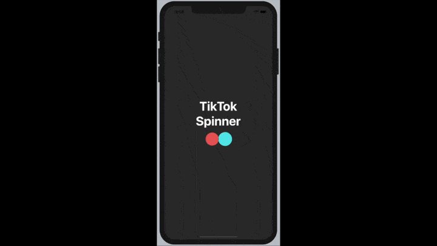
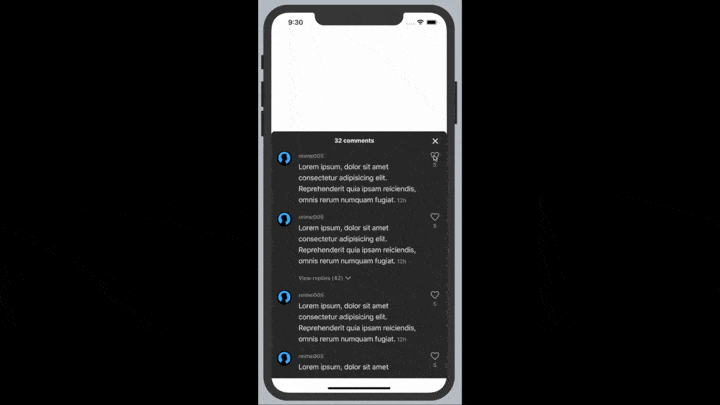

# TikTok Components cloned in React Native

The prototyped clones use react-native-reanimated and react-native-svg for its appearance.

## TikTok Loading Spinner

Uses svg path clipping to have the circle overlay effect.

## TikTok Comments Section

Uses `PanGestureHandler` in combination with FlatList and `useAnimatedRef` / `scrollTo` from react-native-reanimated.

